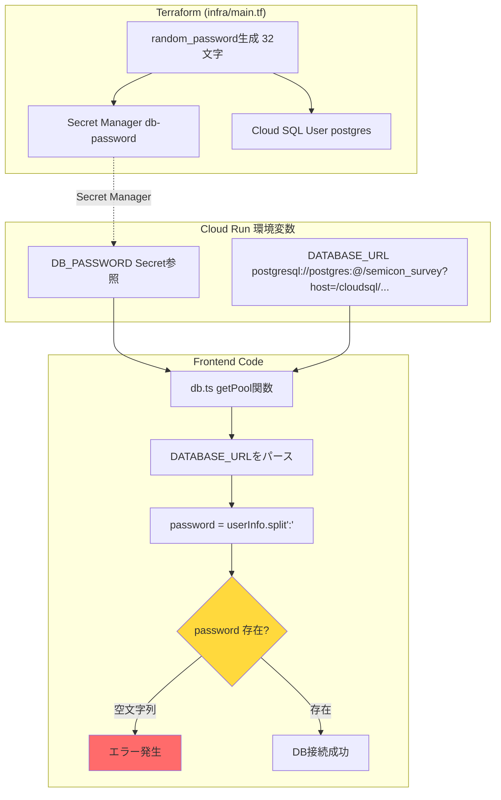
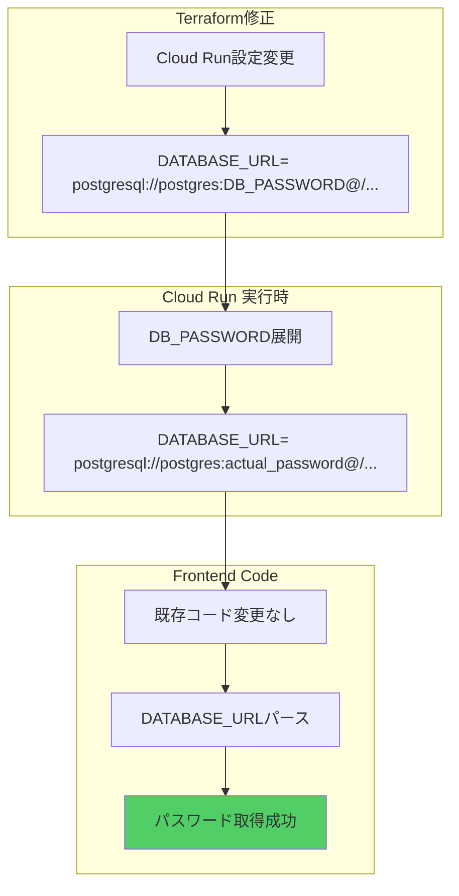
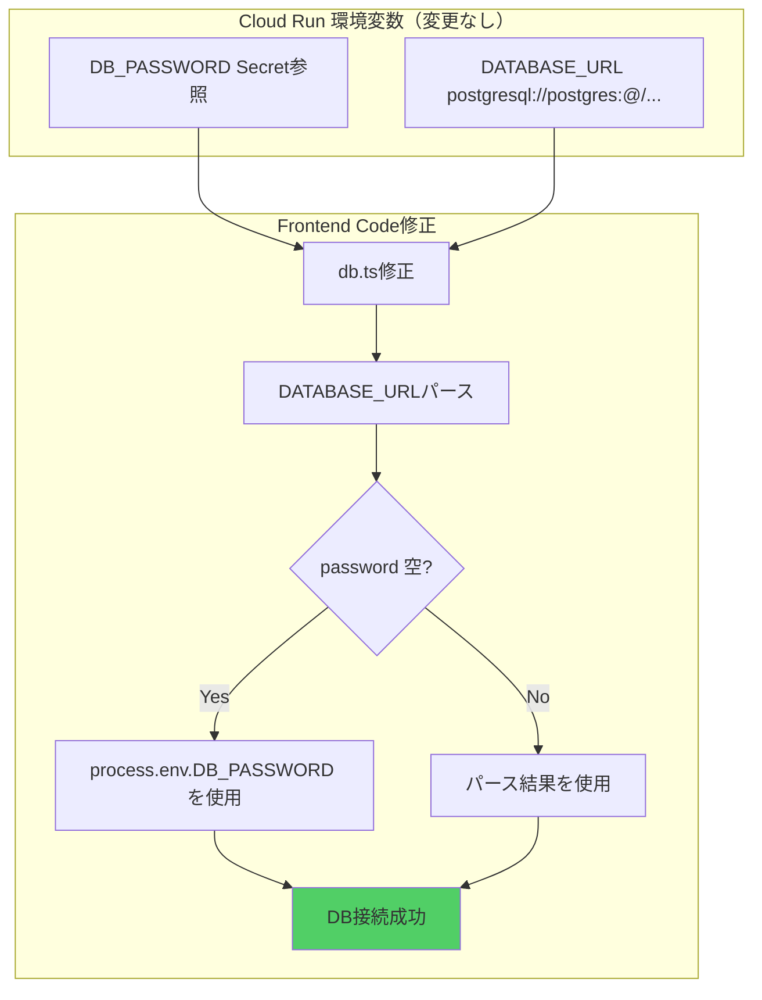
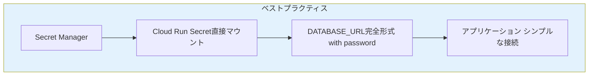

# DBパスワード管理の問題と解決策

## 現在の状態

### フロー図: 現在のDBパスワード管理



### 問題点

1. **Cloud Run設定**: `DATABASE_URL`にパスワードが含まれていない
   - 現在: `postgresql://postgres:@/semicon_survey?...`
   - パスワード部分が空（`:@`の間が空）

2. **環境変数の分離**: `DB_PASSWORD`は別の環境変数として存在するが使用されていない

3. **コードの問題**: [frontend/src/lib/db.ts:35](frontend/src/lib/db.ts#L35)で`userInfo.split(':')`した結果、パスワードが空文字列になる

---

## 解決策の比較

### アプローチA: Cloud Run設定変更（DATABASE_URLにパスワードを含める）



#### メリット

- フロントエンドコード変更不要
- DATABASE_URL形式が標準的
- 他のツール（pgAdmin等）でもそのまま使用可能

#### デメリット

- Terraform設定変更が必要
- Cloud Runの再デプロイが必要
- 環境変数展開の動作確認が必要

#### 実装手順

1. [infra/main.tf](infra/main.tf)のCloud Run設定を修正
2. `terraform apply`実行
3. フロントエンド再デプロイ

---

### アプローチB: フロントエンドコード修正（DB_PASSWORD環境変数を使用）



#### メリット

- インフラ変更不要
- フロントエンドのみの修正で完結
- 素早く修正・デプロイ可能
- 柔軟性が高い（環境変数の優先順位制御可能）

#### デメリット

- フロントエンドコード修正が必要
- DATABASE_URL形式が非標準的

#### 実装手順

1. [frontend/src/lib/db.ts:35-45](frontend/src/lib/db.ts#L35-L45)を修正
2. Dockerビルド＆プッシュ
3. Cloud Runデプロイ

---

## 推奨アプローチ

### 推奨: アプローチB（フロントエンドコード修正）

**理由:**

1. **迅速性**: インフラ変更なしで即座に対応可能
2. **安全性**: Terraform状態に影響を与えない
3. **柔軟性**: 両方の環境変数パターンに対応可能
4. **テスト容易性**: ローカル開発でも本番でも動作

### 修正コード例

```typescript
// frontend/src/lib/db.ts:35付近
const [user, password] = userInfo.split(":");

// パスワードが空の場合、DB_PASSWORD環境変数を使用
const dbPassword = password || process.env.DB_PASSWORD || "";

if (!user || !dbPassword || !database || !host) {
  throw new Error(
    `Missing required connection parameters. user=${!!user}, password=${!!dbPassword}, database=${!!database}, host=${!!host}`
  );
}

pool = new Pool({
  user,
  password: dbPassword,
  database,
  host,
  max: 10,
  idleTimeoutMillis: 30000,
  connectionTimeoutMillis: 2000,
});
```

---

## 将来的な改善案

長期的には、以下の構成を検討:



- DATABASE_URLに完全な接続文字列を含める
- Secret Managerから直接参照
- 環境変数の分離を避ける
