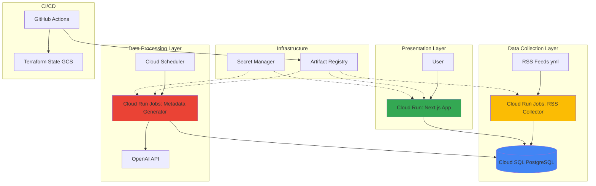
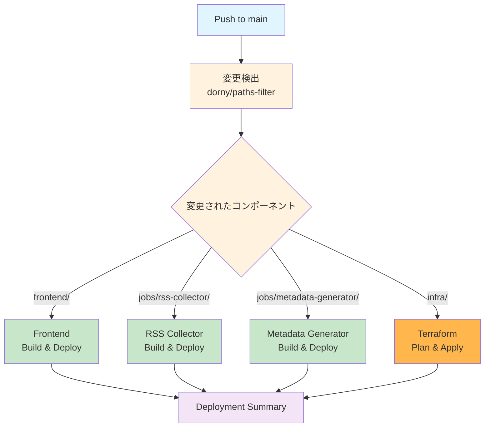

# GCP Semicon Survey Automation


<br>

## 概要

### 要件

1. yml ファイルで指定した複数のサイトから記事を RSS 収集
2. 収集した記事情報を DB に保存
3. python でクローリング+OpenAI API を使い、記事のメタデータ（日付・要約・ラベル・出典）を自動付与
4. 3 番を GCP の Cloud Run や Cloud Scheduler で定期実行
5. 簡単な web アプリから閲覧

### 開発範囲

1. RSS 記事収集、DB 保存、web アプリを GCP で実現する
2. メタデータ付与（クローリング + OpenAI API）
3. GCP の Cloud Run Jobs と Cloud Scheduler で定期実行を実現する

### システム画面

<table>
  <tr>
    <td width="50%">
      
    </td>
    <td width="50%">
      
    </td>
  </tr>
</table>

<br>

## 開発環境

### コーディング環境

- **OS:** Ubuntu 22.04
- **Editor:** VS Code / Google Antigravity IDE
- **Language:** Python 3.12

### LLM 活用・開発フロー

自然言語中心の開発スタイルを採用。

- **Coding:** Claude Code / GitHub Copilot / Gemini
- **Infra:** Terraform (GCP 状態を CLI で確認しながら宣言的に記述)

### モダン開発プラクティス

運用の手間を極小化し、本質的なロジック（プロンプト調整など）に集中するための構成。

- **CI/CD (GitHub Actions):**
  - `main` ブランチへの Push をトリガーに、変更検出 → Docker ビルド → Artifact Registry への Push → Cloud Run へのデプロイを完全自動化。
  - **変更検出ベース:** `dorny/paths-filter` を使用し、変更のあったコンポーネントのみビルド・デプロイ（高速化・コスト削減）。
  - Terraform の `plan` / `apply` もワークフローに統合済み（`infra/` 変更時のみ実行）。
  - **OIDC (OpenID Connect):** サービスアカウントキー（JSON）を発行・保存せず、セキュアに GCP 認証を行う。

<br>

## Tech Stack

- **Backend:** Python 3.12, Docker, OpenAI API
- **Frontend:**
  - **Framework:** Next.js 15 (App Router)
  - **Language:** TypeScript
  - **Package Manager:** pnpm
  - **UI:** Tailwind CSS + shadcn/ui
  - **Rendering:** Server Components + Client Components
- **Database:** Cloud SQL (PostgreSQL 15)
- **IaC:** Terraform
- **GCP:**
  - **Compute:** Cloud Run Jobs (バッチ処理), Cloud Run (Web アプリ)
  - **Trigger:** Cloud Scheduler (Cron 起動)
  - **Security:** Secret Manager (API Key 管理) / IAM (Workload Identity)
  - **Registry:** Artifact Registry
- **CI/CD:** GitHub Actions (OIDC 認証)

<br>

## Architecture

### システム全体構成



### GCP リソース構成

以下のリソースは Terraform で自動作成される。

| リソース                   | 用途                          | 設定                                                             |
| -------------------------- | ----------------------------- | ---------------------------------------------------------------- |
| **Cloud SQL (PostgreSQL)** | 記事データ保存                | PostgreSQL 15, db-f1-micro, Public IP, 自動バックアップ有効      |
| **Artifact Registry**      | Docker イメージ保存           | asia-northeast1, format: DOCKER                                  |
| **Secret Manager**         | DB パスワード、OpenAI API Key | db-password (自動生成), openai-api-key (手動登録)                |
| **Workload Identity**      | GitHub Actions 認証           | Pool + Provider + Service Account                                |
| **Cloud Scheduler**        | 定期実行トリガー              | RSS Collector (6 時間おき), Metadata Generator (6 時間おき + 1h) |

※ Cloud Run Jobs/Service は手動デプロイ（または GitHub Actions で自動デプロイ）

### データベース設計

#### Cloud SQL ネットワーク構成

| 項目             | 設定                   | 説明                                   |
| ---------------- | ---------------------- | -------------------------------------- |
| **接続方式**     | Public IP              | Cloud Run からの接続を簡易化           |
| **認証**         | Cloud SQL 認証プロキシ | Cloud Run の組み込みコネクタ使用       |
| **セキュリティ** | IAM 認証               | サービスアカウントベースのアクセス制御 |
| **バックアップ** | 自動                   | 毎日自動バックアップ（保持期間: 7 日） |

※ 本番環境では Private IP + VPC Connector の使用を推奨

#### articles テーブル

| カラム             | 型           | 説明                                     |
| ------------------ | ------------ | ---------------------------------------- |
| id                 | UUID         | プライマリキー                           |
| title              | VARCHAR(500) | 記事タイトル                             |
| url                | TEXT         | 記事 URL（ユニーク）                     |
| source             | VARCHAR(200) | 記事出典元                               |
| image_url          | TEXT         | 記事トップ画像 URL                       |
| content            | TEXT         | ★ 記事本文（Beautiful Soup で抽出）      |
| published_date     | TIMESTAMP    | ★ 記事公開日（AI 自動付与）              |
| summary            | TEXT         | ★ 記事要約（AI 自動付与）                |
| tags               | TEXT[]       | ★ タグ（AI 自動付与）                    |
| created_at         | TIMESTAMP    | 作成日時                                 |
| updated_at         | TIMESTAMP    | 更新日時                                 |
| metadata_generated | BOOLEAN      | メタデータ付与済みフラグ                 |
| INDEX              | -            | idx_published_date, idx_source, idx_tags |

※ RSS フィードソースは `jobs/rss_feeds.yaml` で管理
※ ★ 印のカラムは Metadata Generator ジョブで自動付与
※ `image_url` は RSS Collector ジョブで meta タグ（og:image）から自動取得

<br>

## CI/CD フロー

変更検出ベースの効率的なデプロイワークフローを実装。



### ワークフローの特徴

- **変更検出:** `dorny/paths-filter` で変更されたディレクトリを検出
- **条件付き実行:** 変更のあったコンポーネントのみビルド・デプロイ
- **並列実行:** 複数のビルドジョブが同時実行（高速化）
- **コスト削減:** 不要なビルド・デプロイをスキップ

### 検出対象パス

| パス                           | トリガーされるジョブ                 |
| ------------------------------ | ------------------------------------ |
| `frontend/**`                  | Frontend ビルド & デプロイ           |
| `jobs/rss-collector/**`        | RSS Collector ビルド & デプロイ      |
| `jobs/metadata-generator/**`   | Metadata Generator ビルド & デプロイ |
| `infra/**`                     | Terraform Plan & Apply               |
| `.github/workflows/deploy.yml` | 全コンポーネントのデプロイ           |

※ ワークフローファイル自体が変更された場合、全コンポーネントがデプロイされる。

<br>

## Folder Structure

```text
gcp-semicon-survey-automation/
├── jobs/
│   ├── rss-collector/              # RSS収集 + クローリングバッチ
│   │   ├── main.py
│   │   ├── requirements.txt
│   │   └── Dockerfile
│   ├── metadata-generator/          # メタデータ付与バッチ
│   │   ├── main.py
│   │   ├── requirements.txt
│   │   └── Dockerfile
│   └── rss_feeds.yaml               # RSSフィード定義
│
├── frontend/                        # Next.js Webアプリ
│   ├── src/
│   │   ├── app/                     # App Router
│   │   │   ├── page.tsx
│   │   │   ├── articles/
│   │   │   │   └── [id]/
│   │   │   │       └── page.tsx
│   │   │   └── api/
│   │   │       └── articles/
│   │   │           └── route.ts
│   │   ├── components/              # UIコンポーネント
│   │   │   ├── ArticleList.tsx
│   │   │   ├── ArticleCard.tsx
│   │   │   └── FilterBar.tsx
│   │   ├── lib/                     # DB接続・リポジトリ
│   │   │   ├── db.ts
│   │   │   └── repositories/
│   │   │       └── articleRepository.ts
│   │   └── types/                   # 型定義
│   │       └── article.ts
│   ├── package.json
│   ├── next.config.js
│   └── Dockerfile
│
├── infra/                           # Terraform IaC
│   ├── main.tf                      # メインリソース定義
│   ├── variables.tf                 # 変数定義
│   ├── outputs.tf                   # 出力定義
│   ├── backend.tf                   # バックエンド設定（GCS）
│   └── provider.tf                  # プロバイダー設定
│
├── .github/
│   └── workflows/
│       └── deploy.yml
│
├── scripts/
│   └── init_db.sql
│
├── .env.example
├── CLAUDE.md
└── README.md
```

<br>

## 構築手順

### 構築の流れ

このプロジェクトは以下の順序で構築する:

1. **事前準備** - GCP プロジェクト作成、.env ファイル作成、ローカルファイル準備
2. **Prerequisites** - 必要なツールのインストール（Terraform、gcloud CLI 等）
3. **GCP Initial Setup** - GCP ログイン、API 有効化
4. **Terraform Setup** - インフラリソースの作成（Cloud SQL、Artifact Registry、Workload Identity 等）
5. **OpenAI API Key 登録** - Secret Manager への登録
6. **データベース初期化** - テーブル作成
7. **GitHub Secrets 登録** - CI/CD 用の認証情報設定
8. **アプリケーションのデプロイ** - Cloud Run Jobs/Service へのデプロイ
9. **動作確認** - 手動実行とフロントエンドアクセス

### 事前準備

#### 1. GCP プロジェクトの準備

- GCP プロジェクトの作成
- GCP プロジェクト 支払いアカウントの設定

#### 2. .env ファイルの作成

プロジェクトルートに `.env` ファイルを作成し、以下の内容を手動で記載する。

```bash
# GCPプロジェクトID
PROJECT_ID="gcp-semicon-survey-automation"

# OpenAI API設定
OPENAI_API_KEY=your-openai-api-key

# GCP Workload Identity Federation設定
GCP_PROJECT_ID=gcp-semicon-survey-automation
GCP_WORKLOAD_IDENTITY_PROVIDER=your-workload-identity-provider
GCP_SERVICE_ACCOUNT=your-service-account
```

#### 3. アプリケーションファイルの準備

以下のディレクトリとファイルを作成する。

##### 3-1. RSS Collector（jobs/rss-collector/）

```bash
mkdir -p jobs/rss-collector
```

**jobs/rss-collector/requirements.txt**

```text
feedparser==6.0.11
requests==2.31.0
beautifulsoup4==4.12.3
psycopg2-binary==2.9.9
python-dotenv==1.0.1
PyYAML==6.0.1
openai==1.54.5
```

**jobs/rss-collector/main.py**

```python
# RSS収集とDB保存のメインロジック
# jobs/sampleのConnection_Confirmation、get_date、get_article_sourceを参考

# 【主要処理フロー】
# 1. rss_feeds.yamlの読み込み（PyYAML）
# 2. feedparserでRSSフィード解析（各ソースのフィードURL）
# 3. 各記事に対して以下を実行:
#
#    ■ 接続確認（Connection_Confirmation相当）
#    - requests.get(url, verify=True)で記事URLに接続
#    - SSL検証を有効にしてHTTPリクエスト
#    - requests.exceptions.RequestExceptionでエラーハンドリング
#    - 接続失敗時: error_codeに例外情報を格納、後続処理をスキップ
#
#    ■ 日付取得（get_date相当）
#    - Beautiful SoupでHTMLパース
#    - 優先順位で日付要素を探索:
#      1. <time>タグから取得（date_element = soup.find("time")）
#      2. <meta>タグから取得（property="article:modified_time" or "date"）
#      3. 特定のクラス名・IDから取得（re.compile(r"date|time|datetime|published|the-date|cal", re.I)）
#    - 'YYYY-MM-DD'形式チェック（re.fullmatch(date_pattern, article_date)）
#    - 日付情報がない場合: OpenAI API（gpt-4o-mini）でISO8601形式に変換
#      - プロンプト: "What is the date '{article_date}' in the 'yyyy-mm-dd' format?Please answer with only the results."
#    - 取得失敗時: "日付情報なし"を設定
#
#    ■ 出典取得（get_article_source相当）
#    - 3段階の取得戦略:
#      1. メタタグから取得（soup.find("meta", property="og:site_name")）
#      2. 出来なければ、URLからドメイン名抽出（urlparse → netloc → "www."削除 → capitalize）
#      3. 出来なければ、AI推論（OpenAI APIでタイトルから出典を1単語で推論）
#
#    ■ トップ画像URL取得
#    - <meta property="og:image">タグから画像URLを取得
#    - soup.find("meta", property="og:image")
#    - 取得できない場合: Noneまたは空文字列
#
# 4. PostgreSQLへの保存
#    - INSERT INTO articles (title, url, source, image_url, published_date, metadata_generated)
#    - ON CONFLICT (url) DO NOTHING（重複チェック）
#    - metadata_generated=falseで初期保存（Metadata Generatorで後処理）
```

**jobs/rss-collector/Dockerfile**

```dockerfile
FROM python:3.12-slim

WORKDIR /app

COPY requirements.txt .
RUN pip install --no-cache-dir -r requirements.txt

COPY main.py .
COPY ../rss_feeds.yaml ./rss_feeds.yaml

CMD ["python", "main.py"]
```

##### 3-2. Metadata Generator（jobs/metadata-generator/）

```bash
mkdir -p jobs/metadata-generator
```

**jobs/metadata-generator/requirements.txt**

```text
requests==2.31.0
beautifulsoup4==4.12.3
psycopg2-binary==2.9.9
python-dotenv==1.0.1
langchain==0.3.13
langchain-openai==0.2.14
openai>=1.58.1
```

**jobs/metadata-generator/main.py**

```python
# メタデータ自動付与のメインロジック
# jobs/sampleのget_article_text、generate_summary_Tagsを参考

# 【主要処理フロー】
# 1. PostgreSQLからmetadata_generated=falseの記事を取得
#    - SELECT * FROM articles WHERE metadata_generated = false LIMIT 100
#
# 2. 各記事に対して以下を実行:
#
#    ■ 記事本文抽出（get_article_text相当）
#    - requests.get(url, verify=True)で記事ページ取得
#    - Beautiful SoupでHTMLパース（soup = BeautifulSoup(article.content, "html.parser")）
#    - soup.get_text()で全テキスト抽出
#    - 不要文字の除去（"\n", "\t", "\r", " "）
#      - for char in characters_to_remove: article_text = article_text.replace(char, "")
#    - article_text.strip()でトリミング
#
#    ■ 要約とタグ生成（generate_summary_Tags相当）
#    - LangChain + OpenAI API（ChatOpenAI）を使用
#    - model: gpt-4o-mini
#
#    【SequentialChain構成】
#    1. 要約生成（chain_1）
#       - PromptTemplate: "次の文章を200字程度で要約して。言語は記事本文と同じで。語尾は断定形で: {article_text}"
#       - output_key: "article_summary"
#
#    2. タグ生成（chain_2）
#       - PromptTemplate:
#         """
#         次の記事の要約から、トピックを表すタグを生成して：
#         {article_summary}.
#         登場する企業、業界、分類を表すような2～20個の単語を、最小単位で、カンマ区切りで。
#         半導体関連の記事は「半導体」というタグを必ず含めて。
#         製品名、サービス名、企業名などの固有名詞も含めて。日本企業は日本語、外国企業はアルファベットで。
#         例: "AI, 半導体, テクノロジー, 自動運転, ソニー, NVIDIA, Apple, iPhone"
#         """
#       - output_key: "article_tags"
#
#    - SequentialChain(chains=[chain_1, chain_2], verbose=True)
#    - output = overall_chain({"article_text": article_text})
#
# 3. PostgreSQLへの更新
#    - UPDATE articles SET
#        content = %s,
#        summary = %s,
#        tags = %s,
#        metadata_generated = true,
#        updated_at = CURRENT_TIMESTAMP
#      WHERE id = %s
```

**jobs/metadata-generator/Dockerfile**

```dockerfile
FROM python:3.12-slim

WORKDIR /app

COPY requirements.txt .
RUN pip install --no-cache-dir -r requirements.txt

COPY main.py .

CMD ["python", "main.py"]
```

##### 3-3. Frontend（frontend/）

```bash
mkdir -p frontend/src/{app,components,lib,types}
mkdir -p frontend/src/app/articles/[id]
mkdir -p frontend/src/app/api/articles
mkdir -p frontend/src/lib/repositories
```

**frontend/package.json**

```json
{
  "name": "gcp-semicon-survey-frontend",
  "version": "0.1.0",
  "private": true,
  "scripts": {
    "dev": "next dev",
    "build": "next build",
    "start": "next start",
    "lint": "next lint"
  },
  "dependencies": {
    "@google-cloud/secret-manager": "^6.1.1",
    "autoprefixer": "^10.4.20",
    "next": "15.1.3",
    "pg": "^8.13.1",
    "postcss": "^8.4.49",
    "react": "^19.0.0",
    "react-dom": "^19.0.0",
    "tailwindcss": "^3.4.17"
  },
  "devDependencies": {
    "@types/node": "^22",
    "@types/pg": "^8.11.10",
    "@types/react": "^19",
    "@types/react-dom": "^19",
    "eslint": "^9",
    "eslint-config-next": "15.1.3",
    "typescript": "^5"
  }
}
```

**frontend/next.config.js**

```javascript
/** @type {import('next').NextConfig} */
const nextConfig = {
  output: "standalone",
};

module.exports = nextConfig;
```

**frontend/tsconfig.json**

```json
{
  "compilerOptions": {
    "target": "ES2020",
    "lib": ["dom", "dom.iterable", "esnext"],
    "allowJs": true,
    "skipLibCheck": true,
    "strict": true,
    "noEmit": true,
    "esModuleInterop": true,
    "module": "esnext",
    "moduleResolution": "bundler",
    "resolveJsonModule": true,
    "isolatedModules": true,
    "jsx": "preserve",
    "incremental": true,
    "paths": {
      "@/*": ["./src/*"]
    }
  },
  "include": ["next-env.d.ts", "**/*.ts", "**/*.tsx"],
  "exclude": ["node_modules"]
}
```

**frontend/Dockerfile**

```dockerfile
# -- ビルドステージ --------------
FROM node:20-alpine AS builder

WORKDIR /app

# pnpmインストール
RUN npm install -g pnpm

# 依存関係のインストール
COPY package.json pnpm-lock.yaml* ./
RUN pnpm install

# アプリケーションファイルコピー
COPY . .

# Next.jsビルド
RUN pnpm build


# -- 実行ステージ --------------
FROM node:20-alpine AS runner

WORKDIR /app

# 環境変数設定
ENV NODE_ENV=production
ENV NEXT_TELEMETRY_DISABLED=1

# 非rootユーザー作成
RUN addgroup --system --gid 1001 nodejs
RUN adduser --system --uid 1001 nextjs

# ビルド成果物をコピー
COPY --from=builder --chown=nextjs:nodejs /app/.next/standalone ./
COPY --from=builder --chown=nextjs:nodejs /app/.next/static ./.next/static

# 非rootユーザーに切り替え
USER nextjs

# ポート公開
EXPOSE 3000

ENV PORT=3000
ENV HOSTNAME="0.0.0.0"

# 実行
CMD ["node", "server.js"]
```

**主要ファイルの構成:**

- `frontend/src/app/page.tsx` - トップページ（記事一覧、トップ画像表示）
- `frontend/src/app/articles/[id]/page.tsx` - 記事詳細ページ
- `frontend/src/components/ArticleCard.tsx` - 記事カードコンポーネント（画像、タイトル、要約、タグを表示）
- `frontend/src/components/FilterPanel.tsx` - フィルターパネルコンポーネント（出典、タグでフィルタリング）
- `frontend/src/lib/db.ts` - PostgreSQL 接続設定（Secret Manager から直接パスワード取得）
- `frontend/src/repositories/articleRepository.ts` - 記事データアクセス層
- `frontend/src/types/article.ts` - 記事型定義

**データベース接続の実装:**

フロントエンドは Secret Manager から直接 DB パスワードを取得する方式を採用。

```typescript
// frontend/src/lib/db.ts
import { Pool } from "pg";
import { SecretManagerServiceClient } from "@google-cloud/secret-manager";

let pool: Pool | null = null;
let secretClient: SecretManagerServiceClient | null = null;

// -- Secret Manager からパスワード取得 --------------
async function getDbPassword(): Promise<string> {
  if (!secretClient) {
    secretClient = new SecretManagerServiceClient();
  }

  const projectId = "gcp-semicon-survey-automation";
  const secretName = `projects/${projectId}/secrets/db-password/versions/latest`;

  const [version] = await secretClient.accessSecretVersion({
    name: secretName,
  });
  const password = version.payload?.data?.toString();

  if (!password) {
    throw new Error("Failed to retrieve password from Secret Manager");
  }

  return password;
}

// -- データベース接続プールの取得 --------------
export async function getPool(): Promise<Pool> {
  if (!pool) {
    const dbPassword = await getDbPassword();

    const host = process.env.DB_SOCKET || "/cloudsql/...";
    const user = process.env.DB_USER || "postgres";
    const database = process.env.DB_NAME || "semicon_survey";

    pool = new Pool({
      user,
      password: dbPassword,
      database,
      host,
      max: 10,
      idleTimeoutMillis: 30000,
      connectionTimeoutMillis: 5000,
    });
  }

  return pool;
}
```

**メリット:**

- DB パスワードを環境変数として渡す必要がない（セキュリティ向上）
- Cloud Run 環境では自動的にプロジェクトが認識される
- パスワードローテーション時も環境変数の更新不要

**フロントエンド表示要件:**

- **記事一覧（ArticleCard）**
  - トップ画像（image_url）をカード上部に表示
  - 画像が存在しない場合: プレースホルダー画像またはグレー背景
  - 画像サイズ: 横幅 100%、縦横比 16:9（object-fit: cover）
  - タイトル、出典、要約、タグ、公開日を表示
  - タグはバッジ形式で表示（Tailwind CSS badge）
- **記事詳細ページ**
  - トップ画像をヘッダー部分に大きく表示
  - 記事本文（content）、要約、タグ、公開日、出典を表示
- **フィルタリング機能**
  - 出典（source）でフィルタリング
  - タグ（tags）でフィルタリング（複数選択可能）
  - 公開日（published_date）で並び替え（降順・昇順）

##### 3-4. GitHub Actions ワークフロー（.github/workflows/）

```bash
mkdir -p .github/workflows
```

**.github/workflows/deploy.yml**

```yaml
# CI/CDワークフロー定義
# トリガー: mainブランチへのPush
# ジョブ:
#   1. 変更検出（infra/, jobs/, frontend/）
#   2. Infraデプロイ（Terraform apply）
#   3. Appデプロイ（Docker build & Cloud Run deploy）
# 認証: Workload Identity Federation（OIDC）
```

### Prerequisites

#### 1. Homebrew のインストール

```bash
/bin/bash -c "$(curl -fsSL https://raw.githubusercontent.com/Homebrew/install/HEAD/install.sh)"

echo >> /home/{user name}/.bashrc
echo 'eval "$(/home/linuxbrew/.linuxbrew/bin/brew shellenv)"' >> /home/{user name}/.bashrc
eval "$(/home/linuxbrew/.linuxbrew/bin/brew shellenv)"

brew --version
```

#### 2. 必要なツールのインストール

```bash
# Terraform
brew install hashicorp/tap/terraform

# Google Cloud SDK (Linux)
sudo snap install google-cloud-cli --classic

# Google Cloud SDK (macOS)
brew install --cask google-cloud-sdk

# GitHub CLI
brew install gh

# PostgreSQL クライアント
brew install postgresql@15
```

### GCP Initial Setup

#### 1. GCP ログインとプロジェクト設定

```bash
# 環境変数設定
export PROJECT_ID="gcp-semicon-survey-automation"
export REGION="asia-northeast1"

# GCPログイン（Terraform実行に必要）
gcloud auth login
gcloud auth application-default login

# プロジェクトIDを設定
gcloud config set project $PROJECT_ID
gcloud auth application-default set-quota-project $PROJECT_ID
```

#### 2. 必要な GCP API を有効化

```bash
# Terraform実行に必要なAPIを一括有効化
gcloud services enable \
  compute.googleapis.com \
  cloudresourcemanager.googleapis.com \
  sqladmin.googleapis.com \
  run.googleapis.com \
  artifactregistry.googleapis.com \
  cloudscheduler.googleapis.com \
  secretmanager.googleapis.com \
  iam.googleapis.com \
  iamcredentials.googleapis.com \
  sts.googleapis.com \
  cloudbuild.googleapis.com \
  servicenetworking.googleapis.com
```

※ API の有効化には数分かかる場合がある

### Terraform Setup

#### 1. Terraform State 管理用の GCS バケット作成

```bash
# State管理用のGCSバケットを作成
gsutil mb -p ${PROJECT_ID} -l ${REGION} gs://${PROJECT_ID}-terraform-state

# バージョニングを有効化
gsutil versioning set on gs://${PROJECT_ID}-terraform-state
```

※ 時間がかかるため注意

#### 2. Terraform ファイルの確認

`infra/` ディレクトリに以下のファイルが配置されている。

- **backend.tf** - GCS でのステート管理設定
- **provider.tf** - Google Cloud Provider 設定
- **variables.tf** - 変数定義（プロジェクト ID、リージョン、GitHub リポジトリ等）
- **main.tf** - 主要リソース定義
  - Workload Identity（GitHub Actions 認証）
  - Artifact Registry（Docker イメージ保存）
  - Cloud SQL（PostgreSQL 15、パスワード自動生成）
  - Secret Manager（DB パスワード、OpenAI API Key）
  - Cloud Scheduler（RSS Collector / Metadata Generator の定期実行）
  - サービスアカウント + IAM ロール
- **outputs.tf** - 出力定義（Workload Identity Provider、サービスアカウント、Cloud SQL 接続名等）

#### 3. Terraform 初期化と適用

```bash
cd infra
terraform init
terraform plan
terraform apply
```

※ `terraform apply` 実行時に、以下のリソースが作成される:

- Artifact Registry リポジトリ
- Cloud SQL インスタンス + データベース + ユーザー（パスワード自動生成）
- Secret Manager シークレット（db-password, openai-api-key）
- Workload Identity Pool + Provider
- サービスアカウント（GitHub Actions 用、Cloud Run 用）
- Cloud Scheduler ジョブ（rss-collector-trigger, metadata-generator-trigger）

#### 4. OpenAI API Key を Secret Manager に登録

Terraform で Secret Manager のシークレットは作成されるが、OpenAI API Key の値は手動で設定する必要がある。

```bash
# .envファイルからOpenAI API Keyを読み込む
source ../.env

# Secret Managerに値を登録
echo -n "${OPENAI_API_KEY}" | gcloud secrets versions add openai-api-key --data-file=-
```

#### 5. データベースの初期化

Cloud SQL インスタンスが作成されたので、テーブルを初期化する。

```bash
# Cloud SQL Auth Proxyをダウンロード
curl -o cloud-sql-proxy https://storage.googleapis.com/cloud-sql-connectors/cloud-sql-proxy/v2.15.0/cloud-sql-proxy.linux.amd64
chmod +x cloud-sql-proxy

# Cloud SQL接続名とインスタンス名を取得
INSTANCE_CONNECTION_NAME=$(terraform output -raw cloudsql_connection_name)
INSTANCE_NAME=$(terraform output -raw cloudsql_instance_name)

# Cloud SQL Auth Proxyを起動（別ターミナルで実行）
./cloud-sql-proxy ${INSTANCE_CONNECTION_NAME} &

# psqlをインストール（未インストールの場合）
sudo apt-get install -y postgresql-client

# データベースに接続してスクリプト実行
# パスワードはTerraformで自動生成されたもの（Secret Managerから取得可能）
DB_PASSWORD=$(gcloud secrets versions access latest --secret="db-password")
PGPASSWORD=${DB_PASSWORD} psql -h localhost -U postgres -d semicon_survey -f ../scripts/init_db.sql

# 初期化確認
PGPASSWORD=${DB_PASSWORD} psql -h localhost -U postgres -d semicon_survey -c "\dt"

# Cloud SQL Auth Proxyを停止
pkill cloud-sql-proxy
```

または、gcloud コマンドで直接実行する方法:

```bash
# gcloud経由でSQL実行（パスワード入力が必要）
gcloud sql connect ${INSTANCE_NAME} --user=postgres --database=semicon_survey < ../scripts/init_db.sql
```

#### 6. Terraform 出力の取得

GitHub Secrets 登録に必要な値を取得する。

```bash
cd infra

# 各値を取得
WI_PROVIDER=$(terraform output -raw workload_identity_provider)
SA_EMAIL=$(terraform output -raw github_actions_service_account)

echo "Workload Identity Provider: $WI_PROVIDER"
echo "Service Account: $SA_EMAIL"
```

### GitHub Secrets への登録

GitHub Actions で CI/CD を実行するために、以下の Secret を登録する。

#### 手順 1: GitHub リポジトリの Settings を開く

1. GitHub リポジトリのページを開く
2. 上部タブの **[Settings]** をクリック
3. 左メニューの **[Secrets and variables]** → **[Actions]** をクリック
4. **[New repository secret]** ボタンをクリック

#### 手順 2: 以下の Secret を登録

| Secret 名                        | 設定値                                                 | 説明                                      |
| -------------------------------- | ------------------------------------------------------ | ----------------------------------------- |
| `GCP_PROJECT_ID`                 | `gcp-semicon-survey-automation`                        | GCP プロジェクト ID                       |
| `GCP_WORKLOAD_IDENTITY_PROVIDER` | Terraform 出力の `workload_identity_provider` の値     | Workload Identity Provider の完全な識別子 |
| `GCP_SERVICE_ACCOUNT`            | Terraform 出力の `github_actions_service_account` の値 | GitHub Actions 用サービスアカウント       |
| `OPENAI_API_KEY`                 | OpenAI API キー（.env ファイルから取得）               | OpenAI API キー                           |

※ Terraform 出力値は `terraform output -raw <output名>` で取得できる

### アプリケーションのデプロイ

#### 事前準備: Dockerfile の作成と rss_feeds.yaml のバンドル

各アプリケーションの Dockerfile では、`rss_feeds.yaml` を Docker イメージにバンドルする。

**jobs/rss-collector/Dockerfile の例:**

```dockerfile
FROM python:3.12-slim

WORKDIR /app

# 依存関係のインストール
COPY requirements.txt .
RUN pip install --no-cache-dir -r requirements.txt

# アプリケーションコードとRSSフィード定義をコピー
COPY main.py .
COPY ../rss_feeds.yaml ./rss_feeds.yaml

CMD ["python", "main.py"]
```

※ `rss_feeds.yaml` はリポジトリの `jobs/rss_feeds.yaml` に配置されており、Docker ビルド時にイメージに含まれる。

#### 1. RSS Collector のデプロイ

```bash
cd jobs/rss-collector

# Docker ビルド & プッシュ
gcloud builds submit --tag asia-northeast1-docker.pkg.dev/${PROJECT_ID}/containers/rss-collector

# Cloud SQL接続名を取得
INSTANCE_CONNECTION_NAME=$(cd ../../infra && terraform output -raw cloudsql_connection_name)

# Cloud Run Jobs デプロイ（環境変数とSecretを設定）
gcloud run jobs deploy rss-collector \
  --image asia-northeast1-docker.pkg.dev/${PROJECT_ID}/containers/rss-collector \
  --region ${REGION} \
  --service-account cloudrun-app@${PROJECT_ID}.iam.gserviceaccount.com \
  --set-secrets=DB_PASSWORD=db-password:latest \
  --set-env-vars=DB_HOST=/cloudsql/${INSTANCE_CONNECTION_NAME} \
  --set-env-vars=DB_NAME=semicon_survey \
  --set-env-vars=DB_USER=postgres \
  --add-cloudsql-instances=${INSTANCE_CONNECTION_NAME} \
  --max-retries 3 \
  --task-timeout 30m
```

#### 2. Metadata Generator のデプロイ

```bash
cd jobs/metadata-generator

# Docker ビルド & プッシュ
gcloud builds submit --tag asia-northeast1-docker.pkg.dev/${PROJECT_ID}/containers/metadata-generator

# Cloud SQL接続名を取得
INSTANCE_CONNECTION_NAME=$(cd ../../infra && terraform output -raw cloudsql_connection_name)

# Cloud Run Jobs デプロイ（環境変数とSecretを設定）
gcloud run jobs deploy metadata-generator \
  --image asia-northeast1-docker.pkg.dev/${PROJECT_ID}/containers/metadata-generator \
  --region ${REGION} \
  --service-account cloudrun-app@${PROJECT_ID}.iam.gserviceaccount.com \
  --set-secrets=DB_PASSWORD=db-password:latest,OPENAI_API_KEY=openai-api-key:latest \
  --set-env-vars=DB_HOST=/cloudsql/${INSTANCE_CONNECTION_NAME} \
  --set-env-vars=DB_NAME=semicon_survey \
  --set-env-vars=DB_USER=postgres \
  --add-cloudsql-instances=${INSTANCE_CONNECTION_NAME} \
  --max-retries 3 \
  --task-timeout 60m
```

#### 3. Frontend のデプロイ

```bash
cd frontend

# Docker ビルド & プッシュ
gcloud builds submit --tag asia-northeast1-docker.pkg.dev/${PROJECT_ID}/containers/frontend

# Cloud SQL接続名を取得
INSTANCE_CONNECTION_NAME=$(cd ../infra && terraform output -raw cloudsql_connection_name)

# Cloud Run Service デプロイ（環境変数とSecretを設定）
gcloud run deploy frontend \
  --image asia-northeast1-docker.pkg.dev/${PROJECT_ID}/containers/frontend \
  --region ${REGION} \
  --service-account cloudrun-app@${PROJECT_ID}.iam.gserviceaccount.com \
  --set-secrets=DB_PASSWORD=db-password:latest \
  --set-env-vars=DB_HOST=/cloudsql/${INSTANCE_CONNECTION_NAME} \
  --set-env-vars=DB_NAME=semicon_survey \
  --set-env-vars=DB_USER=postgres \
  --add-cloudsql-instances=${INSTANCE_CONNECTION_NAME} \
  --allow-unauthenticated \
  --min-instances 0 \
  --max-instances 10
```

※ **環境変数の設定方法:**

- `--set-secrets` - Secret Manager から機密情報を環境変数として注入
  - Frontend では `DB_PASSWORD` は不要（コード内で Secret Manager から直接取得）
- `--set-env-vars` - 通常の環境変数を設定
- `--add-cloudsql-instances` - Cloud SQL への接続を有効化（Cloud SQL Auth Proxy が自動で起動）
- `--service-account` - Cloud Run が使用するサービスアカウント（Terraform で作成済み）
  - サービスアカウントに Secret Manager へのアクセス権限が付与されている必要がある

### 動作確認

#### 1. Cloud Run Jobs の手動実行

```bash
# RSS Collector 実行
gcloud run jobs execute rss-collector --region=${REGION}

# Metadata Generator 実行
gcloud run jobs execute metadata-generator --region=${REGION}
```

#### 2. Frontend へのアクセス

```bash
gcloud run services describe frontend --region=${REGION} --format="value(status.url)"
```

<br>

## CI/CD による自動デプロイ

`.github/workflows/deploy.yml` の作成により、`main` ブランチへの Push で自動デプロイが実行される
