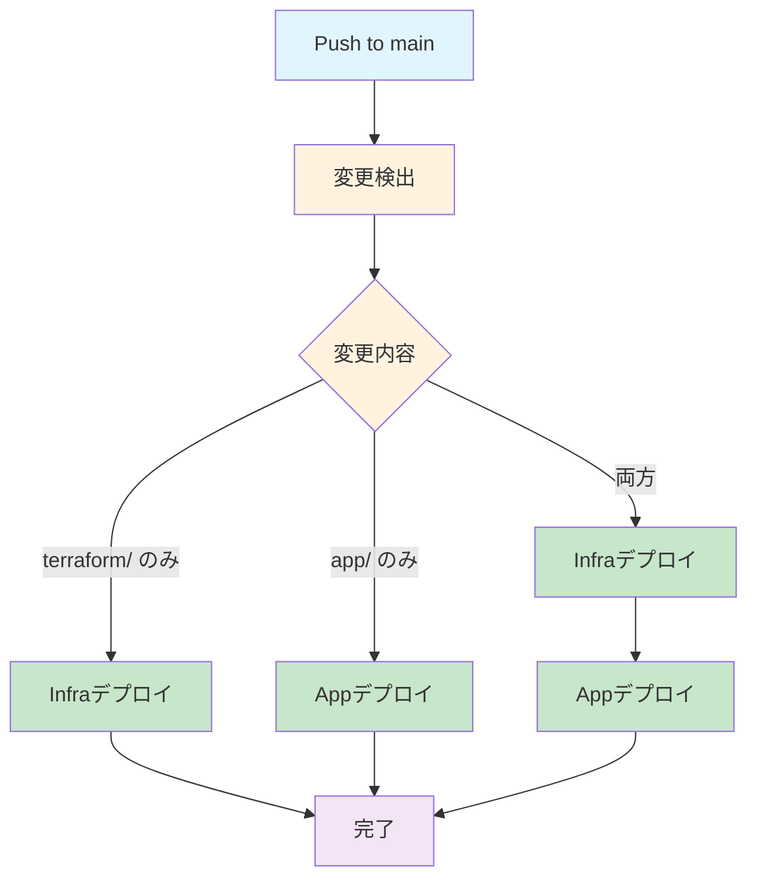

## 概要

### 要件

1. yml ファイルで指定した複数のサイトから記事を RSS 収集
2. 収集した記事情報を DB に保存
3. python で openAI API を使い、記事のメタデータ（日付・要約・ラベル・出典）を自動付与
4. 3 番を GCP の Cloud Run や Cloud Scheduler で定期実行
5. 簡単な web アプリから閲覧

### 開発範囲

1. RSS 記事収集、DB 保存、web アプリを GCP で実現したい。
2. メタデータ付与は、docker 叩けば実行できる状態を実現済み
   - `/src` 配下にコードあり
3. GCP の Cloud Run や Cloud Scheduler での定期実行を実現したい。

---

## 開発環境

### コーディング環境

- **OS:** Ubuntu 22.04
- **Editor:** VS Code / Google Antigravity IDE
- **Language:** Python 3.12

### LLM 活用・開発フロー

自然言語中心の開発スタイルを採用。

- **Coding:** Claude Code / GitHub Copilot / Gemini
- **Infra:** Terraform (GCP 状態を CLI で確認しながら宣言的に記述)

### モダン開発プラクティス

運用の手間を極小化し、本質的なロジック（プロンプト調整など）に集中するための構成。

- **CI/CD (GitHub Actions):**
  - `main` ブランチへの Push をトリガーに、Docker ビルド → Artifact Registry への Push → Cloud Run へのデプロイを完全自動化。
  - Terraform の `plan` / `apply` もワークフローに統合（予定）。
  - **OIDC (OpenID Connect):** サービスアカウントキー（JSON）を発行・保存せず、セキュアに GCP 認証を行う。

---

## Tech Stack

- **App:** Python, Docker, OpenAI API
- **IaC:** Terraform
- **GCP:**
  - **Compute:** Cloud Run Jobs (バッチ処理として実行)
  - **Trigger:** Cloud Scheduler (Cron 起動)
  - **Security:** Secret Manager (API Key 管理) / IAM (Workload Identity)
  - **Registry:** Artifact Registry
- **CI/CD:** GitHub Actions

---

## Architecture

これから記載。

---

## CI/CD フロー

https://github.com/riririyo-1/gcp-notion-automation の .github/workflows/deploy.yml を参考にする。



※ app のみ更新した場合に、infra の更新を待機し続けないように注意。

---

## データモデル

#### 記事のメタデータ（自動収集）

| 項目     | 内容                         |
| -------- | ---------------------------- |
| ID       | 識別子                       |
| タイトル | 記事のタイトル               |
| URL      | 記事の URL                   |
| 日付     | ★ 記事の公開日               |
| 要約     | ★ 記事の要約                 |
| タグ     | ★ 記事のカテゴリやキーワード |
| 出典     | ★ 記事の出典元               |

★ は定期的に自動付与する項目

---

## folder structure

```text
gcp-semicon-survey-automation
├── app/frontend/backendなど必要に応じて追加
├── infra
│   ├── main.tf
│   ├── variables.tf
│   └── outputs.tf
├── src
│   ├── metadata_generator
│   │   ├── main.py
│   │   ├── requirements.txt
│   │   └── Dockerfile
│   └── rss_collector
│       ├── main.py
│       ├── requirements.txt
│       └── Dockerfile
├── .github
│   └── workflows
│       └── deploy.yml
└── README.md
```

---

## GitHub Secrets 管理

Secrets として登録する必要のある項目。

| Secret 名                        | 説明                                                |
| -------------------------------- | --------------------------------------------------- |
| `GCP_PROJECT_ID`                 | GCP プロジェクト ID                                 |
| `GCP_WORKLOAD_IDENTITY_PROVIDER` | Workload Identity Provider の完全な識別子           |
| `GCP_SERVICE_ACCOUNT`            | GitHub Actions 用サービスアカウントのメールアドレス |
| `OPENAI_API_KEY`                 | OpenAI API キー                                     |

---

## 構築手順

### 事前準備

- GCP プロジェクトの作成
- GCP プロジェクト 支払いアカウントの設定
- フォルダ構成の作成

#### .env ファイルの作成

プロジェクトルートに `.env` ファイルを作成し、以下の内容を手動で記載する。

```bash
# GCPプロジェクトID
PROJECT_ID=your_gcp_project_id_here

# Notion API設定
NOTION_API_KEY=your_notion_api_key_here
NOTION_DATABASE_ID=your_notion_database_id_here

# OpenAI API設定
OPENAI_API_KEY=your_openai_api_key_here
```

### Prerequisites

- Terraform CLI のインストール
- gcloud CLI のインストール

```bash
# 0. Homebrewのインストール
/bin/bash -c "$(curl -fsSL https://raw.githubusercontent.com/Homebrew/install/HEAD/install.sh)"

echo >> /home/ryo/.bashrc
echo 'eval "$(/home/linuxbrew/.linuxbrew/bin/brew shellenv)"' >> /home/ryo/.bashrc
eval "$(/home/linuxbrew/.linuxbrew/bin/brew shellenv)"

brew --version

# 1. Install Terraform
brew install hashicorp/tap/terraform

# 2. Install Google Cloud SDK
# Linux の場合
sudo snap install google-cloud-cli --classic
# macOS の場合
brew install --cask google-cloud-sdk

# 3. GitHub CLI（CI/CDの状態確認やSecret設定に便利）
brew install gh
```

### GCP Initial Setup

```bash
# GCPログイン
gcloud auth login
gcloud auth application-default login
# プロジェクトIDを設定
export PROJECT_ID="your-gcp-project-id"
gcloud config set project $PROJECT_ID

# 注: 必要なAPIはTerraformが自動的に有効化します
```

### Workload Identity (OIDC) の設定

GitHub Actions から GCP へ安全に認証するため、Workload Identity を設定する。

```bash
# 1. Workload Identity Pool の作成
gcloud iam workload-identity-pools create "github-pool" \
  --project="${PROJECT_ID}" \
  --location="global" \
  --display-name="GitHub Actions Pool"

# 2. Workload Identity Provider の作成
# ※ `your-github-username` と `gcp-notion-automation` は適宜置き換え
gcloud iam workload-identity-pools providers create-oidc "github-provider" \
  --project="${PROJECT_ID}" \
  --location="global" \
  --workload-identity-pool="github-pool" \
  --display-name="GitHub Provider" \
  --attribute-mapping="google.subject=assertion.sub,attribute.actor=assertion.actor,attribute.repository=assertion.repository,attribute.repository_owner=assertion.repository_owner" \
  --attribute-condition="assertion.repository_owner == 'your-github-username'" \
  --issuer-uri="https://token.actions.githubusercontent.com"

# 3. GitHub Actions 用のサービスアカウント作成
gcloud iam service-accounts create github-actions-sa \
  --display-name="GitHub Actions Service Account"

# 4. サービスアカウントに必要な権限を付与
gcloud projects add-iam-policy-binding $PROJECT_ID \
  --member="serviceAccount:github-actions-sa@${PROJECT_ID}.iam.gserviceaccount.com" \
  --role="roles/run.admin"

gcloud projects add-iam-policy-binding $PROJECT_ID \
  --member="serviceAccount:github-actions-sa@${PROJECT_ID}.iam.gserviceaccount.com" \
  --role="roles/artifactregistry.writer"

gcloud projects add-iam-policy-binding $PROJECT_ID \
  --member="serviceAccount:github-actions-sa@${PROJECT_ID}.iam.gserviceaccount.com" \
  --role="roles/iam.serviceAccountUser"

# 5. Workload Identity Pool とサービスアカウントをバインド
gcloud iam service-accounts add-iam-policy-binding \
  "github-actions-sa@${PROJECT_ID}.iam.gserviceaccount.com" \
  --project="${PROJECT_ID}" \
  --role="roles/iam.workloadIdentityUser" \
  --member="principalSet://iam.googleapis.com/projects/$(gcloud projects describe $PROJECT_ID --format='value(projectNumber)')/locations/global/workloadIdentityPools/github-pool/attribute.repository/your-github-username/gcp-notion-automation"

# 6. Workload Identity Provider の完全な識別子を取得(GitHub Secretsに登録)
gcloud iam workload-identity-pools providers describe "github-provider" \
  --project="${PROJECT_ID}" \
  --location="global" \
  --workload-identity-pool="github-pool" \
  --format="value(name)"
```

#### GitHub Secrets への登録手順

上記の手順 6 で取得した Workload Identity Provider の識別子を、GitHub Secrets に登録する。

1. GitHub リポジトリのページを開く
2. 上部タブの **[Settings]** をクリック
3. 左メニューの **[Secrets and variables]** → **[Actions]** をクリック
4. **[New repository secret]** ボタンをクリック
5. 以下の 2 つの Secret を登録する

| Secret 名                        | 設定値（例）                                                                                   | 役割                                        |
| -------------------------------- | ---------------------------------------------------------------------------------------------- | ------------------------------------------- |
| `GCP_WORKLOAD_IDENTITY_PROVIDER` | `projects/123.../locations/global/workloadIdentityPools/github-pool/providers/github-provider` | Workload Identity の認証エンドポイント      |
| `GCP_SERVICE_ACCOUNT`            | `github-actions-sa@your-project-id.iam.gserviceaccount.com`                                    | GitHub Actions が使用するサービスアカウント |

**補足:**

- `GCP_WORKLOAD_IDENTITY_PROVIDER`: どこで認証するか（認証の入口）
- `GCP_SERVICE_ACCOUNT`: どの権限を使うか（なりすます対象）

### Terraform Setup

#### 1. Terraform State 管理用の GCS バケット作成

Terraform の状態ファイルを GCS に保存するため、事前にバケットを作成する。

```bash
# プロジェクトIDを設定
export PROJECT_ID="your-gcp-project-id"
export REGION="asia-northeast1"

# State管理用のGCSバケットを作成
gsutil mb -p ${PROJECT_ID} -l ${REGION} gs://${PROJECT_ID}-terraform-state

# バージョニングを有効化(状態の履歴管理)
gsutil versioning set on gs://${PROJECT_ID}-terraform-state
```

#### 2. Terraform ファイルの作成

以下のファイルを `terraform/` ディレクトリに作成する。
